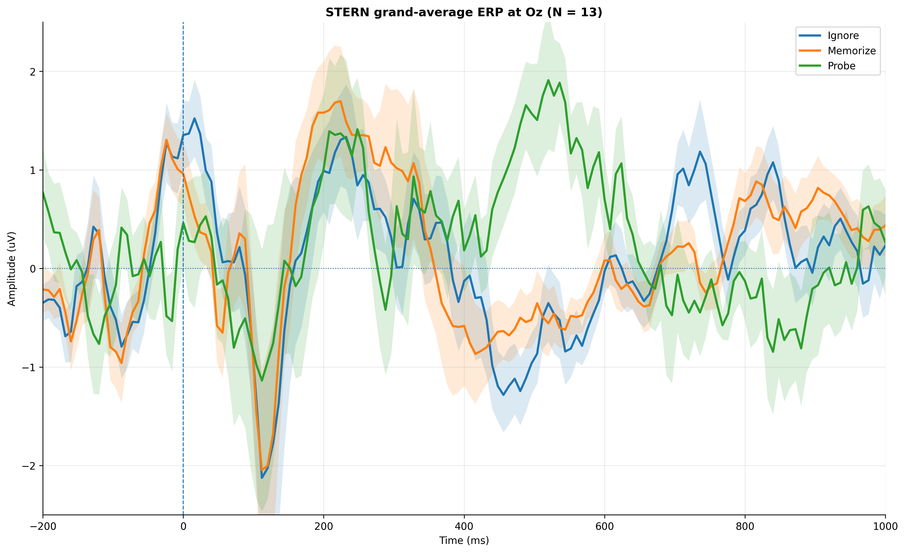
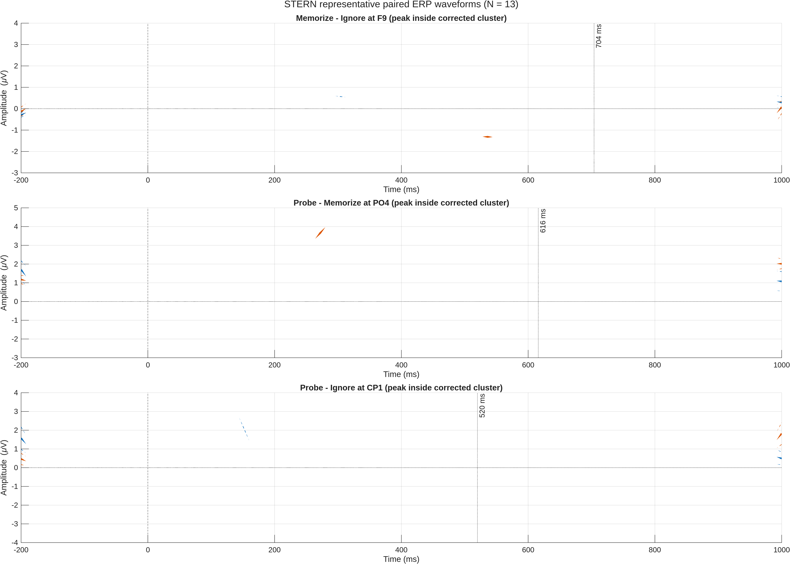
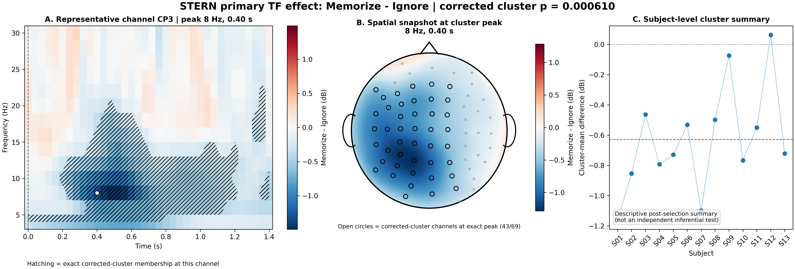
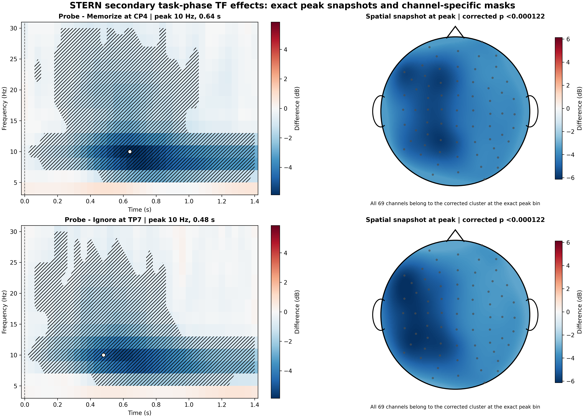

# EEG ERPs and time-frequency analysis — Sternberg task

[](LICENSE)
[](https://github.com/andraderenew/eeg_erps-tf_eeglab-fieldtrip_sternberg/releases)
[](https://doi.org/10.5281/zenodo.21826210)

[](https://orcid.org/0000-0001-5627-579X)

A reproducible group-level EEG analysis of the EEGLAB STERN tutorial study,
combining event-related potentials, time-frequency power, and paired
cluster-based permutation statistics.

## Study and data

- 13 participants and 39 condition-specific EEGLAB datasets.
- Conditions: `Ignore`, `Memorize`, and `Probe`.
- 9,678 epochs and 20,697 events.
- 125 Hz sampling, 3-second epochs from −1.000 to 1.992 s.
- 69 common scalp EEG channels; `LEYE` and `REYE` were excluded.
- Raw EEG is not redistributed.

## Analysis

ERPs were baseline-corrected from −200 to 0 ms. Time-frequency power used
FieldTrip `mtmconvol`, a Hanning taper, four-cycle windows, 4–30 Hz, and dB
normalization to −0.48 to −0.16 s. Paired cluster tests used all 8,192 possible
within-subject permutations.

`Memorize − Ignore` is the primary event-matched letter-onset comparison.
Probe contrasts are secondary task-phase comparisons.

## Primary ERP: Memorize − Ignore

- Positive cluster, 440–552 ms, 50 channels, corrected p = 0.015869.
- Negative cluster, 632–760 ms, 66 channels, corrected p = 0.000366.
- Detailed results: [`stern_erp_cluster_results_final.tsv`](results/tables/stern_erp_cluster_results_final.tsv).





## Primary time-frequency: Memorize − Ignore

- Negative cluster, 4–26 Hz and 0.00–1.40 s, 69 channels, corrected p = 0.000610.
- The final summary uses a representative channel selected at the exact corrected-cluster peak (CP3, 8 Hz, 0.40 s), the channel-specific cluster mask, and a spatial snapshot at that exact time-frequency bin.
- The subject-level panel is explicitly descriptive and post-selection; it is not presented as an independent inferential test.



Additional descriptive and QC summaries are available in
[`stern_tf_Memorize_minus_Ignore_qc_summary_final.png`](results/figures/stern_tf_Memorize_minus_Ignore_qc_summary_final.png).

## Secondary task-phase contrasts

**Probe − Memorize**

- Negative cluster, 6–30 Hz and 0.00–1.40 s, 69 channels, corrected p < 0.000122.

**Probe − Ignore**

- Negative cluster, 6–30 Hz and 0.00–1.40 s, 69 channels, corrected p < 0.000122.

The final secondary figure uses exact peak snapshots and channel-specific corrected-cluster masks with common symmetric scales across the two contrasts. These secondary effects should not be interpreted as pure encoding effects.



## Quality control

- ERP array: `3 × 13 × 69 × 151`, with no non-finite values.
- Time-frequency array: `3 × 13 × 69 × 14 × 50`, with no non-finite values.
- Six statistical result structures passed final validation.
- Primary TF robustness was examined descriptively by subject, band, and time window.
- Final ERP waveform tables are validated in MATLAB and rendered from TSV with Matplotlib.
- Final TF visualization tables are exported from the validated MAT/statistical structures in MATLAB and rendered from TSV with Matplotlib.
- TF statistical masks are kept separate from descriptive sensor averages; final inferential figures use channel-specific masks and exact peak-bin spatial snapshots rather than bounding-box averages.

## Repository structure

```text
scripts/                 final portable MATLAB/Python scripts
results/figures/         final PNG figures and QC summaries
results/tables/          compact TSV tables
results/summaries/       validation summaries
reports/report.md        scientific report
DATA_SOURCES.md          provenance and reuse notes
env/TOOL_VERSIONS.md     validated environment
```

## Limitations

The tutorial dataset contains 13 participants. Cluster inference applies to
connected sample sets, not each sample independently. Probe contrasts combine
task phase and event type. Behavioral covariates were not modeled. Subject-level
cluster summaries extracted from a cluster selected on the same sample are
reported descriptively rather than as independent confirmation. Raw EEG is
excluded because no clear standalone redistribution license was identified in
the material reviewed.

## Citation

Please cite the latest tagged GitHub release using [`CITATION.cff`](CITATION.cff).
The archived Zenodo `v1.0.0` record remains available at
[10.5281/zenodo.21826210](https://doi.org/10.5281/zenodo.21826210).
A newer version-specific Zenodo DOI is not stated here until it has been independently confirmed from Zenodo.
